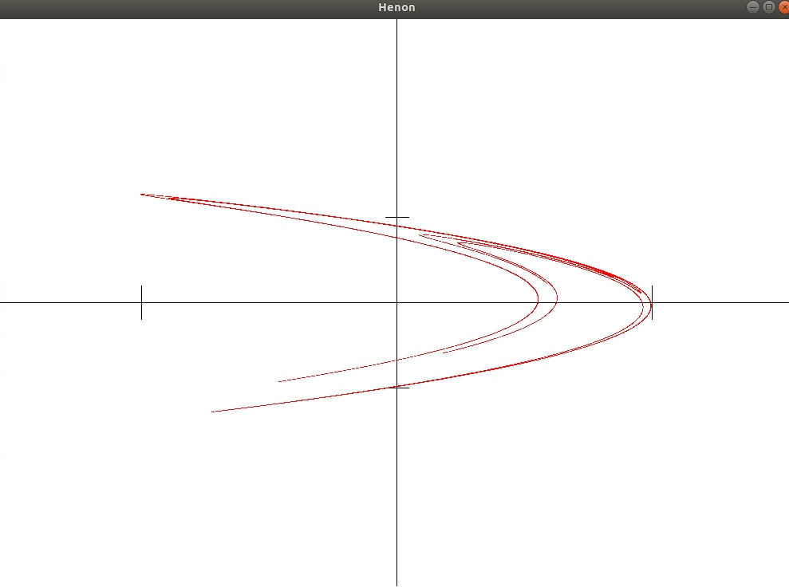
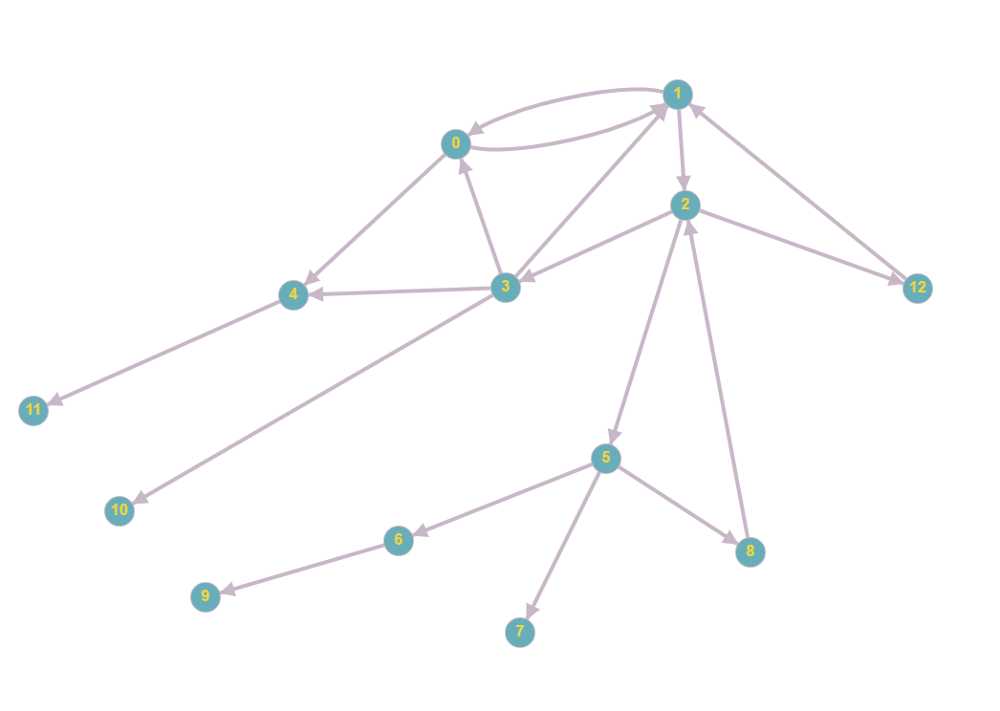
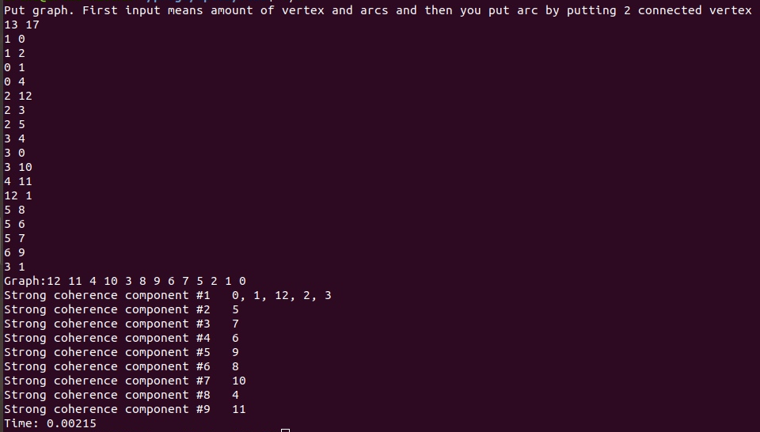
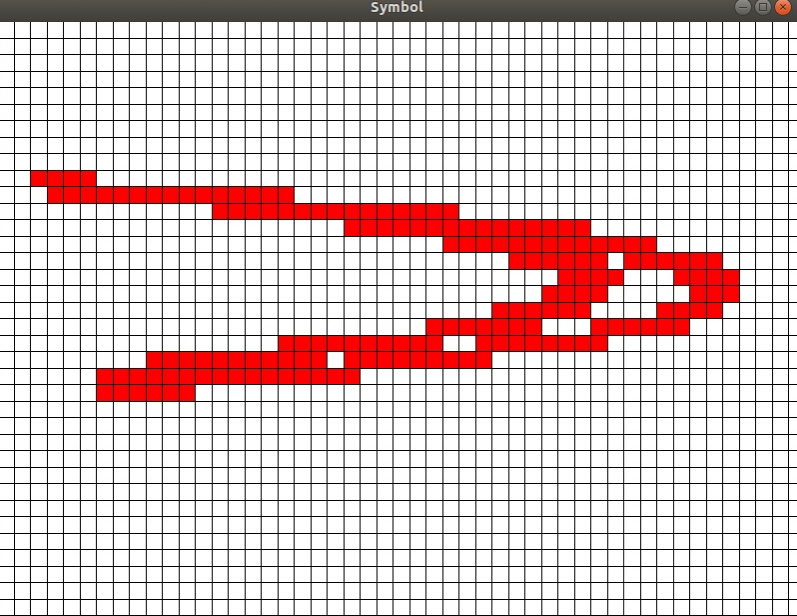

#Direcrories:

media: "Readme.md" pics and vids

#Programs:

1. simple henon mapping visualization
	*f(x,y) = (1 - ax^2 + y,bx)*

2. search for strongly connected components

5. non-iterative way to build "localization of chain recurrent set", lacks performance
(Henon was chosen just for example)

Derived program from previous two.
